import Admonition from '../../components/content/Admonition.astro';

## Introduction

This comprehensive guide demonstrates **every markdown feature** available on The Copilot Stack. Whether you're writing technical documentation, tutorials, or blog posts, this guide serves as both a _reference_ and a ~~testing ground~~ **showcase** for all available formatting options.

> [!NOTE]
> This post is automatically updated to reflect the latest markdown capabilities. Bookmark it for quick reference when writing content!

---

## Text Formatting

### Basic Formatting

You can format text in various ways:

- **Bold text** using double asterisks or underscores
- _Italic text_ using single asterisks or underscores
- **_Bold and italic_** combining both
- ~~Strikethrough~~ using double tildes
- `Inline code` using backticks
- [Hyperlinks](https://github.com/sebastienlevert/the-copilot-stack) to external resources

### Headings

All heading levels are supported and automatically get anchor links:

# Heading 1
## Heading 2
### Heading 3
#### Heading 4
##### Heading 5
###### Heading 6

---

## Lists

### Unordered Lists

- First level item
- Another first level item
  - Nested second level
  - Another nested item
    - Third level nesting
    - More third level
- Back to first level

### Ordered Lists

1. First item
2. Second item
   1. Nested numbered item
   2. Another nested item
3. Third item
   - You can mix list types
   - Like this

### Task Lists

- [x] Completed task
- [x] Another completed task
- [ ] Pending task
- [ ] Another pending task

---

## Blockquotes

Simple blockquotes for emphasis:

> This is a simple blockquote. It can span multiple lines and will be styled consistently with the terminal theme.

Nested blockquotes:

> First level quote
>
> > Nested quote inside
> >
> > > Triple nested quote

---

## Admonitions

We support six types of admonitions with GitHub-style syntax:

> [!NOTE]
> Notes provide helpful information that users should know, even if they're just skimming the content. Use notes for non-critical information.

> [!INFO]
> Info admonitions are perfect for providing additional context, background information, or interesting facts related to the topic.

> [!TIP]
> Tips offer helpful advice or best practices. Use tips to share your expertise and help readers achieve better results.

> [!WARNING]
> Warnings alert users about potential issues or important considerations they should be aware of before proceeding.

> [!CAUTION]
> Cautions indicate that users should proceed carefully. There may be risks or important steps that shouldn't be skipped.

> [!DANGER]
> Danger admonitions signal critical information about actions that could cause data loss, security issues, or system failures.

---

## Tables

Tables are perfect for comparing features or organizing data:

| Feature | Supported | Notes |
|---------|-----------|-------|
| **Code Highlighting** | ✅ | All major languages |
| **Line Numbers** | ✅ | Automatic |
| **Mermaid Diagrams** | ✅ | All diagram types |
| **Admonitions** | ✅ | 6 types available |
| **Copy Code** | ✅ | One-click copying |
| **Anchor Links** | ✅ | All headings |

### Complex Tables

| Syntax | Language | Use Case | Example |
|--------|----------|----------|---------|
| TypeScript | `typescript` | Modern JS apps | `const x: number = 42;` |
| C# | `csharp` | .NET development | `var x = 42;` |
| TypeSpec | `typespec` | API definitions | `model User { }` |
| Mermaid | `mermaid` | Diagrams | `graph TD; A-->B;` |

---

## Code Examples

### Inline Code

Use `backticks` for inline code like `const greeting = "Hello World"` within sentences.

### Basic Code Block

```javascript
function greet(name) {
  console.log(`Hello, ${name}!`);
  return true;
}

greet("World");
```

### TypeScript with Type Annotations

```typescript
interface User {
  id: string;
  name: string;
  email: string;
  roles: string[];
}

async function fetchUser(userId: string): Promise<User> {
  const response = await fetch(`/api/users/${userId}`);

  if (!response.ok) {
    throw new Error(`Failed to fetch user: ${response.statusText}`);
  }

  const user: User = await response.json();
  return user;
}
```

### Line Highlighting

```typescript
// Regular line
const apiKey = process.env.API_KEY; // [!code highlight]
const endpoint = "https://api.example.com"; // [!code highlight]

// This line is not highlighted
function callApi() {
  return fetch(endpoint, { // [!code highlight]
    headers: { Authorization: `Bearer ${apiKey}` } // [!code highlight]
  }); // [!code highlight]
}
```

### Diff Notation

```typescript
// Old implementation
function authenticate(username, password) { // [!code --]
  return username === "admin" && password === "password"; // [!code --]
} // [!code --]

// New secure implementation
async function authenticate(username: string, password: string): Promise<boolean> { // [!code ++]
  const hashedPassword = await bcrypt.hash(password, 10); // [!code ++]
  const user = await db.users.findOne({ username }); // [!code ++]
  return user && await bcrypt.compare(password, user.hashedPassword); // [!code ++]
} // [!code ++]
```

### C# Example

```csharp
using System;
using System.Threading.Tasks;
using Microsoft.Graph;

public class CopilotService
{
    private readonly GraphServiceClient _graphClient;

    public CopilotService(GraphServiceClient graphClient)
    {
        _graphClient = graphClient ?? throw new ArgumentNullException(nameof(graphClient));
    }

    public async Task<User> GetCurrentUserAsync()
    {
        try
        {
            var user = await _graphClient.Me
                .Request()
                .Select(u => new { u.DisplayName, u.Mail, u.Id })
                .GetAsync();

            return user;
        }
        catch (ServiceException ex)
        {
            Console.WriteLine($"Error getting user: {ex.Message}");
            throw;
        }
    }
}
```

### TypeSpec Example

```typespec
import "@typespec/http";
import "@typespec/rest";

using TypeSpec.Http;
using TypeSpec.Rest;

@service({ title: "Copilot Plugin API" })
@server("https://api.copilot.example.com", "Production API")
namespace CopilotPlugin;

model User {
  @key
  @visibility("read")
  id: string;

  displayName: string;
  email: string;
  roles: string[];

  @visibility("read")
  createdAt: utcDateTime;
}

model CreateUserRequest {
  displayName: string;
  email: string;
  roles: string[];
}

@route("/users")
interface Users {
  @get
  list(): User[];

  @get
  read(@path id: string): User;

  @post
  create(@body user: CreateUserRequest): User;

  @patch
  update(@path id: string, @body user: User): User;

  @delete
  remove(@path id: string): void;
}
```

### JSON Configuration

```json
{
  "name": "copilot-plugin",
  "version": "1.0.0",
  "description": "A Copilot extensibility plugin",
  "main": "dist/index.js",
  "scripts": {
    "build": "tsc",
    "start": "node dist/index.js",
    "dev": "nodemon --watch src --exec ts-node src/index.ts"
  },
  "dependencies": {
    "@microsoft/microsoft-graph-client": "^3.0.7",
    "express": "^4.18.2",
    "typescript": "^5.3.3"
  },
  "engines": {
    "node": ">=18.0.0"
  }
}
```

### YAML Configuration

```yaml
name: Deploy Copilot Plugin
on:
  push:
    branches: [main]
  pull_request:
    branches: [main]

env:
  NODE_VERSION: '18.x'
  AZURE_WEBAPP_NAME: copilot-plugin

jobs:
  build-and-deploy:
    runs-on: ubuntu-latest
    steps:
      - name: Checkout code
        uses: actions/checkout@v3

      - name: Setup Node.js
        uses: actions/setup-node@v3
        with:
          node-version: ${{ env.NODE_VERSION }}
          cache: 'npm'

      - name: Install dependencies
        run: npm ci

      - name: Run tests
        run: npm test

      - name: Build application
        run: npm run build

      - name: Deploy to Azure
        uses: azure/webapps-deploy@v2
        with:
          app-name: ${{ env.AZURE_WEBAPP_NAME }}
          publish-profile: ${{ secrets.AZURE_WEBAPP_PUBLISH_PROFILE }}
          package: .
```

### Bash Script

```bash
#!/bin/bash

# Copilot Plugin Deployment Script
set -e

echo "🚀 Starting deployment..."

# Environment variables
export NODE_ENV=production
export API_URL="https://api.copilot.example.com"

# Colors for output
GREEN='\033[0;32m'
RED='\033[0;31m'
NC='\033[0m' # No Color

# Function to check if command exists
command_exists() {
    command -v "$1" >/dev/null 2>&1
}

# Verify prerequisites
if ! command_exists node; then
    echo -e "${RED}Error: Node.js is not installed${NC}"
    exit 1
fi

if ! command_exists npm; then
    echo -e "${RED}Error: npm is not installed${NC}"
    exit 1
fi

# Install dependencies
echo "📦 Installing dependencies..."
npm ci

# Run tests
echo "🧪 Running tests..."
npm test

# Build application
echo "🔨 Building application..."
npm run build

# Deploy
echo "☁️  Deploying to production..."
npm run deploy

echo -e "${GREEN}✅ Deployment completed successfully!${NC}"
```

### PowerShell Script

```powershell
# Copilot Plugin Health Check Script
param(
    [Parameter(Mandatory=$true)]
    [string]$ApiUrl,

    [Parameter(Mandatory=$false)]
    [int]$TimeoutSeconds = 30
)

$ErrorActionPreference = "Stop"

function Test-ApiHealth {
    param([string]$Endpoint)

    try {
        Write-Host "🔍 Checking endpoint: $Endpoint" -ForegroundColor Cyan

        $response = Invoke-RestMethod -Uri "$ApiUrl$Endpoint" `
                                      -Method Get `
                                      -TimeoutSec $TimeoutSeconds

        Write-Host "✅ Endpoint healthy" -ForegroundColor Green
        return $true
    }
    catch {
        Write-Host "❌ Endpoint failed: $_" -ForegroundColor Red
        return $false
    }
}

# Check critical endpoints
$endpoints = @("/health", "/api/users", "/api/plugins")
$results = @()

foreach ($endpoint in $endpoints) {
    $result = Test-ApiHealth -Endpoint $endpoint
    $results += @{
        Endpoint = $endpoint
        Status = if ($result) { "Healthy" } else { "Failed" }
    }
}

# Display summary
Write-Host "`n📊 Health Check Summary:" -ForegroundColor Yellow
$results | ForEach-Object {
    Write-Host "$($_.Endpoint): $($_.Status)"
}
```

### XML Configuration

```xml
<?xml version="1.0" encoding="utf-8"?>
<configuration>
  <appSettings>
    <add key="CopilotApiUrl" value="https://api.copilot.example.com" />
    <add key="ApiVersion" value="v1" />
    <add key="TimeoutSeconds" value="30" />
    <add key="MaxRetries" value="3" />
  </appSettings>

  <connectionStrings>
    <add name="DefaultConnection"
         connectionString="Server=localhost;Database=CopilotDB;Trusted_Connection=True;"
         providerName="System.Data.SqlClient" />
  </connectionStrings>

  <system.web>
    <compilation debug="false" targetFramework="4.8" />
    <httpRuntime targetFramework="4.8" />
  </system.web>

  <system.webServer>
    <handlers>
      <add name="aspNetCore" path="*" verb="*" modules="AspNetCoreModuleV2" resourceType="Unspecified" />
    </handlers>
    <aspNetCore processPath="dotnet"
                arguments=".\CopilotPlugin.dll"
                stdoutLogEnabled="false"
                stdoutLogFile=".\logs\stdout"
                hostingModel="inprocess" />
  </system.webServer>
</configuration>
```

---

## Mermaid Diagrams

### Flowchart

```mermaid
graph TD
    A[User Request] --> B{Authentication}
    B -->|Valid Token| C[Process Request]
    B -->|Invalid Token| D[Return 401]
    C --> E{Check Permissions}
    E -->|Authorized| F[Execute Plugin]
    E -->|Unauthorized| G[Return 403]
    F --> H[Transform Data]
    H --> I[Return Response]
    G --> J[Log Access Attempt]
    D --> J
    I --> K[End]
    J --> K
```



### Sequence Diagram


### Class Diagram


### State Diagram


### Gantt Chart


### Entity Relationship Diagram


### Git Graph


### Pie Chart


---

## Images

### Standard Image


*Figure 1: High-level architecture of a Copilot plugin showing the flow from user request to data source.*

### Image with Caption


*Figure 2: OAuth 2.0 authentication flow illustrating the token exchange process between client, authorization server, and resource server.*

---

## Links

### Internal Links

- [Getting Started Guide](/the-copilot-stack/blog/getting-started-with-copilot-extensibility)
- [Advanced Authentication](/the-copilot-stack/blog/advanced-authentication-patterns)
- [All Episodes](/the-copilot-stack/episodes)
- [About Page](/the-copilot-stack/about)

### External Links

- [Microsoft 365 Developer Portal](https://developer.microsoft.com/microsoft-365)
- [TypeSpec Documentation](https://typespec.io)
- [GitHub Repository](https://github.com/sebastienlevert/the-copilot-stack)
- [Sébastien's Blog](https://www.sebastienlevert.com)

### Reference Links

You can also use reference-style links[^1] for cleaner markdown when you have many links to manage[^2].

[^1]: This is a footnote explaining reference-style links.
[^2]: Footnotes are automatically numbered and appear at the bottom of the page.

---

## Horizontal Rules

You can create horizontal rules using three or more hyphens, asterisks, or underscores:

---

***

___

---

## Escaping Characters

Sometimes you need to display markdown characters literally:

- Use backslash to escape: \*not italic\*
- Or use inline code: `*not italic*`
- Examples: \# \* \_ \[ \] \( \)

---

## HTML Support

While markdown is preferred, you can embed HTML when needed:

<div style="padding: 1rem; border: 2px solid var(--terminal-green); border-radius: 0.5rem; background: var(--terminal-gray);">
  <strong>Custom HTML Block</strong>
  <p>This is a custom styled block using HTML and inline CSS.</p>
  <ul>
    <li>Feature 1</li>
    <li>Feature 2</li>
    <li>Feature 3</li>
  </ul>
</div>

---

## Keyboard Shortcuts

Use the `<kbd>` tag for keyboard shortcuts:

- Press <kbd>Ctrl</kbd> + <kbd>C</kbd> to copy
- Press <kbd>Ctrl</kbd> + <kbd>V</kbd> to paste
- Press <kbd>Ctrl</kbd> + <kbd>Shift</kbd> + <kbd>P</kbd> to open command palette

---

## Best Practices

> [!TIP]
> When writing content, follow these best practices for optimal readability:
>
> 1. Use headings hierarchically (don't skip levels)
> 2. Add alt text to all images
> 3. Use admonitions sparingly for important information
> 4. Test all code examples before publishing
> 5. Include language identifiers in code blocks for proper highlighting
> 6. Use Mermaid diagrams for complex workflows and architectures
> 7. Keep tables simple and readable
> 8. Add captions to images and diagrams

---

## Conclusion

This guide demonstrates the rich markdown capabilities available on The Copilot Stack. From simple text formatting to complex Mermaid diagrams, you have all the tools needed to create engaging, informative content.

> [!INFO]
> **Pro Tip:** Keep this page bookmarked as a quick reference when writing new content. You can copy examples directly and modify them for your needs!

### What's Next?

- Explore our [tag system](/the-copilot-stack/tags/markdown) to find related content
- Check out the [author profile](/the-copilot-stack/authors/sebastienlevert) for more articles
- View the [source code](https://github.com/sebastienlevert/the-copilot-stack) to see how these features are implemented

---

**Happy writing!** 🚀
